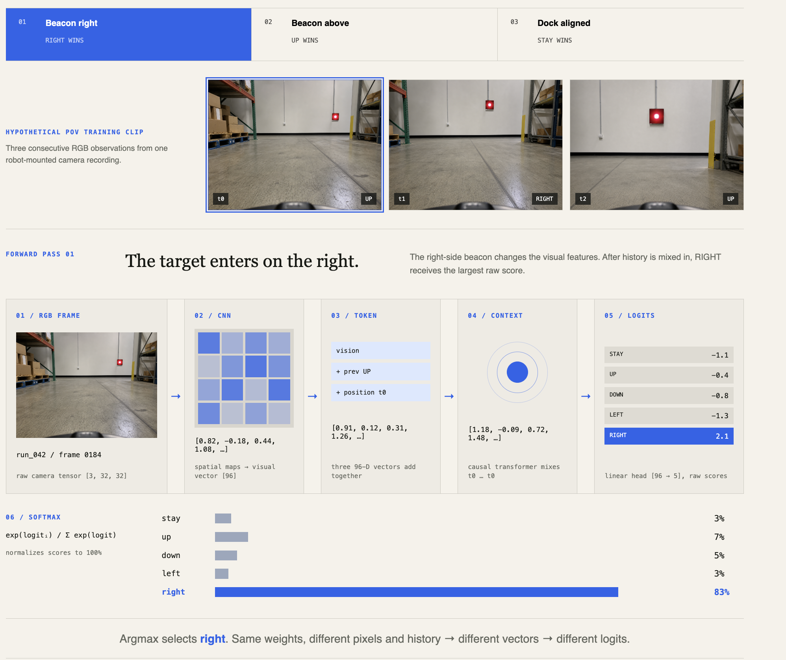
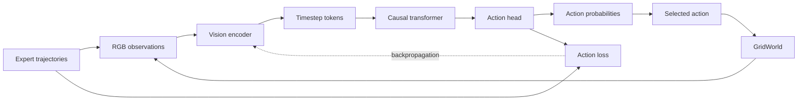

# vat-mini


*Closed-loop sim rollout on RoboMimic Can after a `make robomimic-can` training run.*

Trained for 10 epochs at batch size 16 (10k train / 1k validation samples, sequence length 12, lr 3e-4). By the final epoch the 7-DoF action policy reaches a training loss of ~0.022 with a validation action MAE of ~0.062 (MSE ~0.022).

A small vision-action transformer sandbox that can train and run end to end on a MacBook Pro.

It uses a visual GridWorld and discrete actions to make data generation, causal modeling, training, post-training, checkpointing, and closed-loop evaluation concrete without requiring a robot dataset or a GPU server.

## Repo contents

- a compact convolutional vision encoder + causal action transformer in PyTorch;
- deterministic synthetic expert trajectories with separate train/validation seeds;
- supervised policy pretraining with behavior cloning;
- advantage-weighted imitation as a simple post-training stage;
- MPS acceleration on Apple silicon with CPU fallback;
- YAML configs, dotted CLI overrides, checkpoints, config snapshots, and JSONL metrics;
- optional live experiment tracking with W&B metrics, rollout GIFs, and model artifacts;
- teacher-forced and closed-loop rollout evaluation;
- unit/integration tests and a small smoke run;
- a React learning workbench with interactive tensor, attention, and training visuals.

Examples supported:
- GridWorld path (5 dimensional controls)
- image-based RoboMimic HDF5 (7 dimensional controls). the same causal policy can be trained on realistic simulator camera frames.

## Quick start

Requirements: macOS or Linux, Python 3.11–3.12, and `make`. Python 3.12 is recommended. The learning site additionally needs Node.js 20+.

```bash
make setup
make inspect
make test
make smoke
```

`make setup` creates `.venv` and installs the project in editable mode. `make inspect` prints the PyTorch version and the selected accelerator. On Apple silicon, `device: auto` prefers MPS and falls back to CPU when Metal is unavailable.

The smoke run is intentionally tiny and pins itself to CPU because Metal dispatch overhead dominates kernels at this size. It validates data → forward/backward → evaluation → checkpoint persistence; it is not a quality benchmark. The larger pretraining and post-training configs use `device: auto` and therefore select MPS on this Mac.

## Watch training in W&B

W&B tracking is optional and disabled by default. Local JSONL metrics and checkpoints remain the source-of-truth artifacts whether tracking is enabled or not.

Install the tracking extra and authenticate once:

```bash
make setup-tracking
.venv/bin/wandb login
```

Then enable it with normal dotted overrides:

```bash
.venv/bin/vat-mini train \
  --config configs/pretrain.yaml \
  --set tracking.enabled=true \
  --set tracking.run_name=pretrain-baseline
```

The live run contains:

- batch loss, token accuracy, and mean advantage weight after every optimizer update;
- training summaries and validation metrics after every epoch;
- one fixed-seed closed-loop GridWorld GIF and action table per epoch by default;
- final rollout success, path efficiency, and return;
- the final checkpoint, resolved config, and JSONL metrics as a model artifact;
- automatic CPU, memory, disk, network, and supported accelerator telemetry from W&B.

An **optimizer step** is one model update from one batch. An **epoch** is one complete pass through all training batches. If 1,024 examples use a batch size of 32, each epoch contains 32 optimizer steps. Charts update per batch; validation and the visual rollout update per epoch.

For a fully local capture that can be uploaded later, skip login and override the mode:

```bash
.venv/bin/vat-mini train \
  --config configs/pretrain.yaml \
  --set tracking.enabled=true \
  --set tracking.mode=offline
```

Set `tracking.rollout_every_epochs=2` (or a larger interval) if GIF generation is too frequent. Tracking configuration is part of the resolved config snapshot, so the dashboard and local run remain reproducible.

## Train the full local baseline

```bash
make pretrain
make posttrain
make evaluate
```

## Train on RoboMimic Can images

Install the lightweight HDF5 dependency:

```bash
make setup-robotics
```

Obtain the RoboMimic **Can / proficient-human / image** HDF5 dataset and place it at:

download link: https://downloads.cs.stanford.edu/downloads/rt_benchmark/can/ph/image.hdf5

```text
data/robomimic/can/ph/image.hdf5
```

The file must use RoboMimic's normal layout: `data/demo_*/obs/agentview_image`, `actions`, and optionally `rewards`. The released image datasets work directly; if starting from a raw state-only dataset, use RoboMimic's observation-extraction tooling first. Then inspect a small run before committing to the full configuration:

```bash
.venv/bin/vat-mini train \
  --config configs/robomimic-can.yaml \
  --set data.train_samples=256 \
  --set data.validation_samples=64 \
  --set training.epochs=1

make robomimic-can
```

This path uses only `agentview_image` initially. The loader keeps the HDF5 file on disk and lazily reads fixed-length windows, resizes frames to 84×84, normalizes pixels to `[0, 1]`, and predicts the next normalized action vector:

```text
camera frames + shifted previous 7D controls → causal transformer → next 7D control
```

The seven outputs are continuous controls, not seven categories. The output head uses `tanh`, behavior cloning uses masked mean-squared error, and validation reports action MSE and MAE. Dataset demonstrations—not adjacent windows—are separated into train and validation splits.

The commands perform three explicit steps:

1. `make pretrain` generates the deterministic dataset and behavior-clones the shortest-path expert into `runs/pretrain/`.
2. `make posttrain` generates a separate, controlled-noise dataset, loads `runs/pretrain/latest.pt`, lowers the learning rate, and applies reward-to-go advantage weighting into `runs/posttrain/`.
3. `make evaluate` reloads the post-training checkpoint and reports held-out token accuracy plus autoregressive rollout success, path efficiency, and return.

Run a command directly when you want a different config or an override:

```bash
.venv/bin/vat-mini train \
  --config configs/pretrain.yaml \
  --set training.epochs=2 \
  --set data.train_samples=256
```

Useful CLI commands:

```text
vat-mini inspect
vat-mini generate-data --config CONFIG [--output PATH]
vat-mini train         --config CONFIG [--checkpoint PATH] [--set KEY=VALUE]
vat-mini evaluate      --config CONFIG [--checkpoint PATH] [--episodes N]
vat-mini smoke         --config configs/smoke.yaml
```

## Open the learning workbench

```bash
make learn
```

Vite prints the local URL. The workbench explains the model using a distributed-systems mental model, lets you manipulate the live tensor contract, animates causal attention and the training loop, maps visuals to the actual Python modules, and provides the exact commands above.

To verify a production build without starting the dev server:

```bash
make learn-build
```

## Architecture, training, and inference

The model turns each RGB observation into a visual embedding, combines it with the previous action and timestep position, mixes the available history with a causal transformer, and produces five action logits. Softmax converts those logits into probabilities; inference selects the highest-probability action and feeds it back into the next step.



During behavior-cloning pretraining, the expert action is the target. Cross-entropy measures the prediction error, backpropagation sends that error through the action head, transformer, and vision encoder, and the optimizer updates all three. Post-training starts from the pretrained checkpoint and gives more weight to actions associated with better returns.



## Quick reference

| Concept | VAT Mini contract |
| --- | --- |
| Observation | RGB GridWorld image, `[B, T, 3, 32, 32]` |
| Vision encoder | Compresses each image into a learned vector, `[B, T, D]` |
| Timestep token | `visual embedding + previous-action embedding + position embedding` |
| Causal context | Prediction at `t` can read observations through `t` and actions before `t`, never the future |
| Action head | Produces five logits: `stay`, `up`, `down`, `left`, `right` |
| Pretraining | Behavior cloning with cross-entropy against shortest-path expert actions |
| Post-training | Reward-to-go advantage-weighted imitation initialized from the pretraining checkpoint |
| Validation | Teacher-forced loss and token accuracy on unseen expert trajectories |
| Inference | Autoregressive closed-loop rollout using the model's own previous actions |
| Best behavioral metric | Closed-loop rollout success; replay accuracy alone can hide compounding errors |

| Goal | Command |
| --- | --- |
| Set up the environment | `make setup` |
| Inspect PyTorch and device selection | `make inspect` |
| Run tests | `make test` |
| Validate the full pipeline quickly | `make smoke` |
| Train the behavior-cloned policy | `make pretrain` |
| Run advantage-weighted post-training | `make posttrain` |
| Evaluate the saved policy | `make evaluate` |
| Open the interactive guide | `make learn` |
| Verify the learning-site build | `make learn-build` |

## Repository map

```text
configs/                  local experiment definitions
docs/architecture.md      model, stage, and system design
learning-site/            React + TypeScript interactive guide
src/vat_mini/
  cli.py                  command composition
  config.py               typed YAML configuration + validation
  data.py                 GridWorld, expert trajectories, datasets
  model.py                vision encoder + causal action transformer
  objectives.py           behavior cloning + advantage weighting
  trainer.py              optimization and logging loop
  evaluation.py           held-out and closed-loop metrics
  tracking.py             optional W&B metrics, media, and artifacts
  checkpoint.py           portable atomic checkpoints
  device.py               accelerator selection + seeding
tests/                    fast unit and integration coverage
```

See [docs/architecture.md](docs/architecture.md) for tensor flow, stage semantics, production patterns, and deliberately deferred features.

## How to read the code

If you are learning deep learning from a systems background, use this order:

1. `config.py`: the experiment contract.
2. `data.py`: the request schema and label source.
3. `model.py`: tensor transformations and causal boundary.
4. `objectives.py`: the optimization signal.
5. `trainer.py`: the stateful runtime loop.
6. `evaluation.py`: the difference between replaying known history and running the service closed loop.
7. `checkpoint.py` and `cli.py`: persistence and operator surface.

The key invariant is:

```text
prediction at time t may use observations through t and actions before t,
but never the target action at t or information from the future.
```

## Configuration and artifacts

Every config is validated before work begins. `--set` accepts repeatable dotted overrides and rejects unknown fields. Each run directory contains:

- `config.json`: the resolved configuration;
- `metrics.jsonl`: machine-readable epoch and final metrics;
- `<stage>-epoch-NNN.pt`: numbered checkpoints;
- `latest.pt`: the latest portable checkpoint.

Checkpoints are loaded on CPU first, so the same file can move between MPS, CUDA, and CPU environments.

## Practical Mac notes

- Use Python 3.12 rather than this machine's system Python 3.14. PyTorch's macOS installation guide currently recommends Python 3.9–3.12.
- Keep `num_workers: 0` until the single-process path is stable; multiprocessing overhead is often counterproductive for this tiny in-memory dataset.
- Float32 is the safe default. Add mixed precision only after profiling shows it is useful and every selected operation is supported on MPS.
- Accelerator choice is workload-dependent. The tiny smoke config is dramatically faster on CPU; profile both CPU and MPS before assuming the GPU wins for a small model.
- If an MPS operation is unsupported, `PYTORCH_ENABLE_MPS_FALLBACK=1` allows CPU fallback, but it can hide slow device transfers. Treat it as a diagnostic option, not a performance guarantee.
- Closed-loop rollout success matters more than teacher-forced action accuracy. A policy can obtain attractive replay metrics while compounding small mistakes during execution.

Official references: [PyTorch macOS setup](https://docs.pytorch.org/get-started/locally/), [MPS backend](https://docs.pytorch.org/docs/stable/notes/mps.html), and [MPS environment variables](https://docs.pytorch.org/docs/stable/mps_environment_variables.html).

## Suggested next milestones

After the baseline is understood and measured:

1. add obstacles and a BFS expert to increase planning difficulty;
2. add masked-patch visual pretraining and explicit encoder transfer;
3. add noisy/off-policy trajectories or pairwise preferences for stronger post-training;
4. add language instructions and cross-attention;
5. move from discrete to tokenized or continuous action heads;
6. introduce real recorded trajectories and simulator adapters behind the same dataset protocol;
7. add experiment sweeps only after the useful search space is understood.
